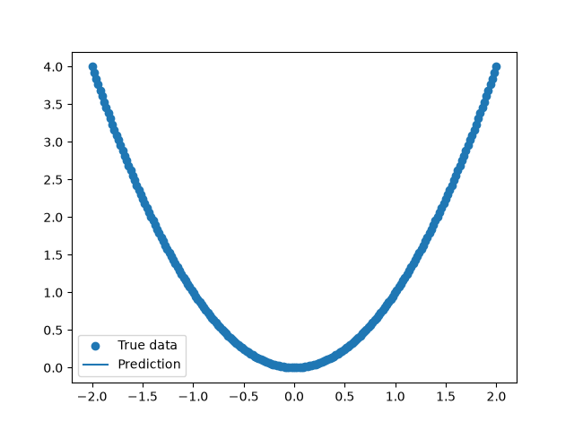

<<<<<<< HEAD
## Comparison and Evaluation of Quantum-inspired forecasting network
## Overview

This project is to see if we can use quantum-inspired math to make networks better at predicting time-series data.
No machine learning tools like TensorFlow or PyTorch are involved.
The main process is to build a neural network from scratch using NumPy.
Then a quantum-inspired feature mapping is added, after which comparisons between it to the regular neural network will be conducted.
I am doing this project on my own as part of my research portfolio.

---

## Objectives

- Build a network from the ground up.

- Understand how the math works for the network.

- Make a quantum-inspired feature mapping.

- Compare the quantum-inspired model to the model on some forecasting datasets.

- Look at how accurate the predictions are and how the models are trained.

---

## Current Progress

- [x] Feedforward neural network
- [x] Backpropagation
- [x] Gradient descent
- [x] XOR classification
- [x] Regression (learning y = x²)
- [x] Time-series forecasting
- [ ] Quantum-inspired feature mapping
- [ ] Experimental evaluation

---

## Technologies

- Python

- NumPy

- Matplotlib

- Git

- GitHub

---

## Future Work

- I will make a quantum-inspired feature representation

- I will compare it to the regular neural network

- I will see how well it works on forecasting datasets

- I will make some graphs to show how well the neural network was trained and how well it predicted

## Regression Demo

---

## Author

Le Duc Minh

